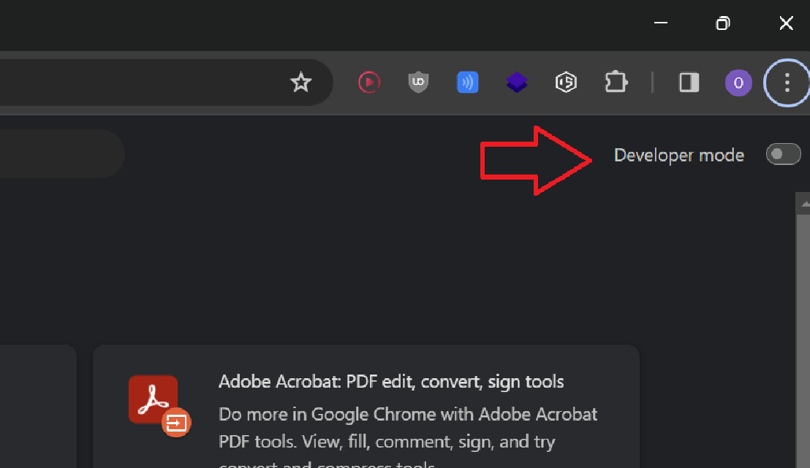

# Watchdog: Secrets Scanning Engine

The Secrets Scanning Engine is a robust tool developed to aid cybersecurity professionals and developers in identifying inadvertent leaks of sensitive information in their projects. Whether you're in the pre-deployment phase or need ongoing post-deployment security, this tool has you covered.

> Note - You can find a powerpoint presentation [here](https://github.com/NotSooShariff/secrets-scanning-engine/blob/main/assets/Watchdog%20Project%20Presentation.pdf) if you're looking for more of just a high level overview

## Features

- **Active Scanning**: A background script runs continuously to actively scan your local machine for any potential leaks of sensitive information pre-deployment.
- **Chrome Extension**: The included Chrome extension helps detect exposed secrets within your source code, providing an added layer of security post-deployment.
- **Intuitive Dashboard**: The GUI/dashboard offers real-time alerts and monitoring, ensuring you stay informed about any security risks.

## Technologies Used
- Rust 
- NextJS
- Electron
- Manifest V2

## Get our Desktop App 

Head over to the [releases section](https://github.com/NotSooShariff/secrets-scanning-engine/releases) and download the files from the latest release. Then unzip the package and run the `.exe` file. Voila! sit back and let our application handle all the heavy lifting.

## Get our Browser Extension

Due to chrome's change in policies since Chrome 80, Extensions can no longer directly be installed through CRX files. Unfortunately for us, this does add a couple of steps by having to download our extension unpacked.

The steps can be found below:
1. Clone our repository by running the following command:
   ```
   git clone https://github.com/NotSooShariff/secrets-scanning-engine.git
   ```
2. Headover to your favourite chromium browser and go to the extensions setting. You can do this by typing the following in your URL bar:
   ```
   <!-- For Google Chrome -->
    chrome://extensions/ 
   ```
   ```
   <!-- For Brave -->
    brave://extensions/ 
   ```
3. Look for a toggle to enable `developer mode`
   
   
   
4. You should now be able to load unpacked extensions from your system. 
5. Click on the `load unpacked` option on the top left and select the `browser-extension` folder from within our repository that you just cloned and your extension will be added successfully under the name of **"Watchdog"**

**Note** - Please be sure to use a Chromium based browser for the best experience. This includes browsers like:
- Chrome 
- Brave 
- Opera
- Edge 
- Vivaldi 


